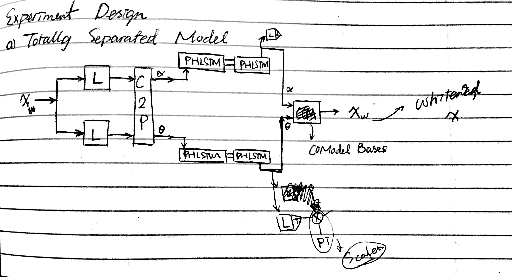
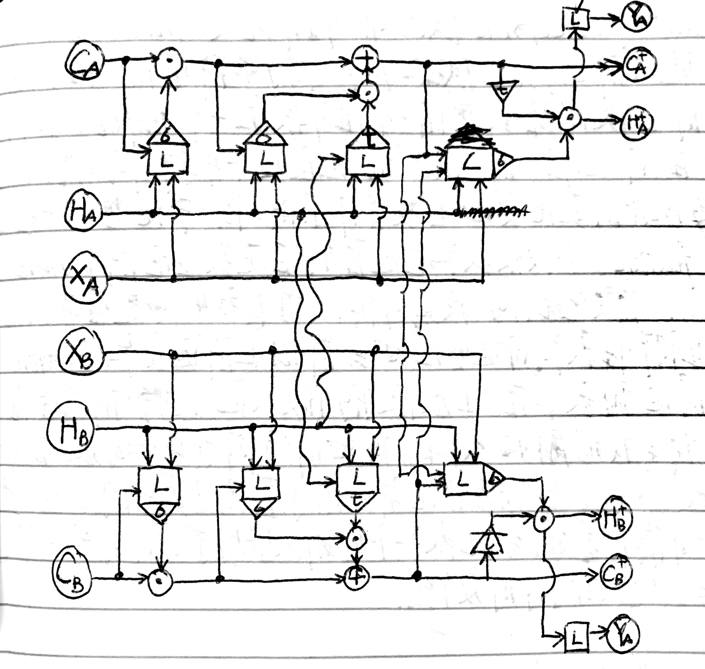

# Separated Recurrent Model for NPLab3D

This experiment tries to test PHLSTM-Codec's power on 3D motion dataset. Before it, I have tried original PHLSTM-Codec on NPLab3D dataset, and obtained frame-mean as prediction. However, even earlier, I tested *RecCO* model on NPLab3D and obtained predictions that can get a sense of motion (very weak though). This time, I would like to combine them together. This design is essential a codec for *RecCO* unit.

**Mon Oct  2 14:39:10 EDT 2017**
After about 60 hours training, model run 70k iterations (batchsize = 32). The result I get can reconstruct a better result than *RecCO* model. It can correctly predict the transformation of objects (opposite to background). So in scaling and rotation with object away from center I can get a good sense of motion in the model prediction of 15 frames based on 15 frames input. However, the reconstruction of background (most of time is the ground in 3D scenes) is quite noisy and cannot preserve its motion pattern. This is easy to understand. Because the texture on the ground is very weak and can not make big difference in terms of MSE in reconstruction. So, the objective function I used in training pretend to make trade-off on it. Besides, there is underlying overfitting problem in this model. Currently, effective dimension (after whitening) of a frame is 269, while only 20k sequence used in training, and I don't make separation of training and testing set here.

**Mon Oct  2 18:06:00 EDT 2017**
Use Dual-PHLSTM (DPHLSTM) to continue the optimization process on NPLab3D dataset.

**Wed Oct  4 10:00:05 EDT 2017**
DPHLSTM structure accelerate decreasing process of objective value. However, according to the result I get from 10k iteration. It is similar to PHLSTM structure on NPLab3D dataset. It still very struggle to reconstruct background (ground plain) and keep the 3D motion sense of them. 

One clear problem is the objective function I used, weighted-MSE, is not a good criteria for this task. Because background always has lower variance and then make less impact to MSE value in the end. A straight-forward improvement is use another criteria aside with MSE, and this criteria should focus on motion part. However, this criteria is not so easy to find. *One idea in my mind is use encoder itself to compare similarity of image sequence*.

Another concern locates at overfitting problem. Currently, I use all the data in training (only 20k sequence at all). There is no testing set and independent validate set. I should update the scripts to make the separation and keeping log of training, validating, and testing scores. Besides, I should also test the model on Transform2D dataset, which contains unlimited data in theory and also leave background alone, which should be beneficial for the model.

I should also consider train a complex bases in convolutional way, then combine it with recurrent unit to see whether or not it can recover more background details.

**Sat Oct 28 09:59:28 EDT 2017**
Run experiment of recurrent model on NPLab3D's prediction with objective function evaluated on pixel space instead of whitening space with weights. I try to use this modification to overcome the problem that model overlook the background in reconstruction of future frames.